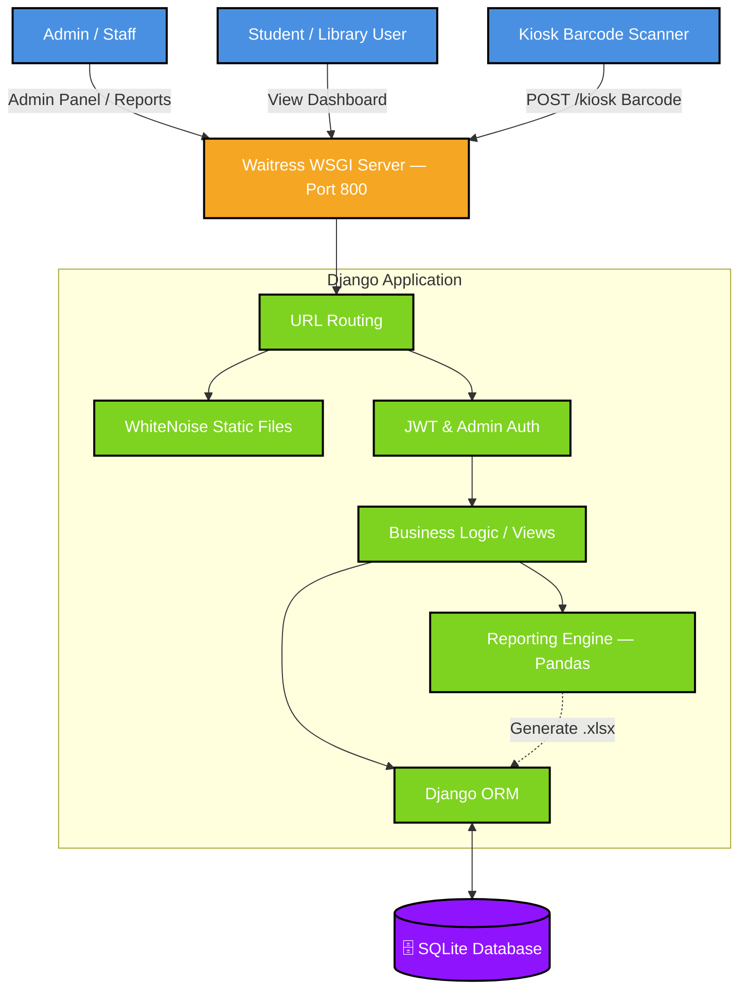

# 📚 GECDahod Library Management System

A full-featured library management system built with Django for **Government Engineering College Dahod**. It handles book issuing, student records, kiosk scanning, JWT authentication, and Excel report generation.

---

## 🏗️ System Architecture



---

## 🚀 Running From Scratch (Complete Setup Guide)

Follow these steps if you are setting this up for the **very first time** on a new computer.

### ✅ Prerequisites

Before you begin, make sure you have the following installed:

| Tool | Minimum Version | Download Link |
|---|---|---|
| **Python** | 3.10+ | [python.org/downloads](https://www.python.org/downloads/) |
| **Git** | Any recent version | [git-scm.com](https://git-scm.com/) |

> **⚠️ Windows Users:** During Python installation, make sure to check **"Add Python to PATH"**.

---

### Step 1 — Clone the Repository

Open a terminal (Command Prompt or PowerShell) and run:

```bash
git clone https://github.com/PAVAN2005-LAB/GED_Dahod_library.git
cd GED_Dahod_library
```

---

### Step 2 — Create a Virtual Environment

A virtual environment keeps project dependencies isolated from the rest of your system.

```bash
# Create the virtual environment
python -m venv venv

# Activate it (Windows)
venv\Scripts\activate

# Activate it (macOS / Linux)
source venv/bin/activate
```

> You should now see `(venv)` at the start of your terminal prompt — that means it is active.

---

### Step 3 — Install Dependencies

```bash
pip install -r requirements.txt
```

This installs everything the project needs: Django, Waitress, Pandas, WhiteNoise, and more.

---

### Step 4 — Configure Environment Variables

The project needs a `.env` file for secret keys and settings.

```bash
# Windows
copy .env.example .env

# macOS / Linux
cp .env.example .env
```

Now open the `.env` file in any text editor and update the following values:

```env
# Generate a random secret key — keep this private!
DJANGO_SECRET_KEY=replace-this-with-a-long-random-string

# Set to True for local development, False for production
DJANGO_DEBUG=True

# For local use, keep as-is. For network use, also add your PC's IP address.
DJANGO_ALLOWED_HOSTS=localhost,127.0.0.1
```

> **Tip:** You can generate a secure secret key by running:
> ```bash
> python -c "from django.core.management.utils import get_random_secret_key; print(get_random_secret_key())"
> ```

---

### Step 5 — Set Up the Database

Run these commands to create all the database tables:

```bash
python manage.py makemigrations
python manage.py migrate
```

---

### Step 6 — Collect Static Files

```bash
python manage.py collectstatic --noinput
```

This bundles all CSS, JS, and images so they are served correctly by WhiteNoise.

---

### Step 7 — Create an Admin Account

```bash
python manage.py createsuperuser
```

You will be prompted to enter a username, email, and password. **Remember these** — you will use them to log into the admin panel.

---

### Step 8 — Start the Server

```bash
python run_server.py
```

The server will start on **port 800**. Open your browser and visit:

| Page | URL |
|---|---|
| Kiosk / Home | `http://localhost:800` |
| Admin Panel | `http://localhost:800/admin` |
| Student Dashboard | `http://localhost:800/dashboard/` |

---

## 🌐 Accessing from Other Devices on the Same Network

If you want other computers or students on the same Wi-Fi / LAN to access the system:

1. Find your computer's IP address:
   ```bash
   # Windows
   ipconfig

   # macOS / Linux
   ifconfig
   ```
   Look for something like `192.168.x.x`.

2. Update your `.env` file:
   ```env
   DJANGO_ALLOWED_HOSTS=localhost,127.0.0.1,192.168.x.x
   DJANGO_DEBUG=False
   ```

3. Restart the server: `python run_server.py`

4. Other devices on the network can now open:
   ```
   http://192.168.x.x:800
   ```

---

## 📦 Bulk Import Data (Students & Books)

Quickly populate the database from `.csv` files instead of adding records one by one.

### Import Students

*Required CSV columns: `enrollment_id`, `name`, `email`, `mobile_no`, `department`*

```bash
python manage.py import_data students /path/to/your/students.csv
```

### Import Books

*Required CSV columns: `access_code`, `title`, `author`, `shelf_location`*

```bash
python manage.py import_data books /path/to/your/books.csv
```

> Sample CSV files are included in the project root: `example_students.csv` and `example_books.csv`.

---

## 📄 API Documentation

A full REST API is available for integration with barcode scanners, mobile apps, or other systems.

**[→ Read the full API Documentation](API_DOCS.md)**

---

## ⚡ Key Features

| Feature | Description |
|---|---|
| **Waitress Server** | Production-grade WSGI server, handles multiple users concurrently on Windows |
| **WhiteNoise** | Efficiently serves static files without needing a separate web server |
| **Kiosk Mode** | Barcode scanner integration for self-service book issue / return |
| **JWT Auth** | Secure token-based API authentication |
| **Excel Reports** | One-click `.xlsx` report generation powered by Pandas |
| **Bulk Import** | Fast CSV import for students and books with automatic duplicate detection |

---

## 🛠️ Common Issues & Fixes

| Problem | Fix |
|---|---|
| `python` not recognised | Make sure Python is installed and **added to PATH** |
| `pip` not found | Use `python -m pip install -r requirements.txt` instead |
| Port 800 already in use | Change the port number in `run_server.py` (e.g. to `8080`) |
| `ModuleNotFoundError` | Activate the virtual environment first: `venv\Scripts\activate` |
| Static files not loading | Run `python manage.py collectstatic --noinput` again |
| `ALLOWED_HOSTS` error | Add your IP address to `DJANGO_ALLOWED_HOSTS` in `.env` |

---

## 📁 Project Structure

```
GED_Dahod_library/
├── config/              # Django settings, URLs, WSGI/ASGI
├── management/          # Main app — models, views, APIs
├── templates/           # HTML templates
├── static/              # Source static files
├── staticfiles/         # Collected static files (auto-generated)
├── example_books.csv    # Sample book data for bulk import
├── example_students.csv # Sample student data for bulk import
├── manage.py            # Django management CLI
├── requirements.txt     # Python dependencies
├── run_server.py        # Production server startup script
└── .env.example         # Environment variable template
```

---

> **Note:** For development and feature work, please switch to the `local` branch.
